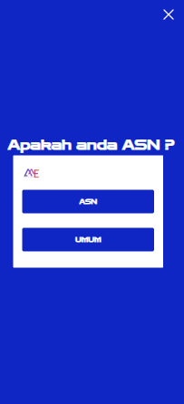
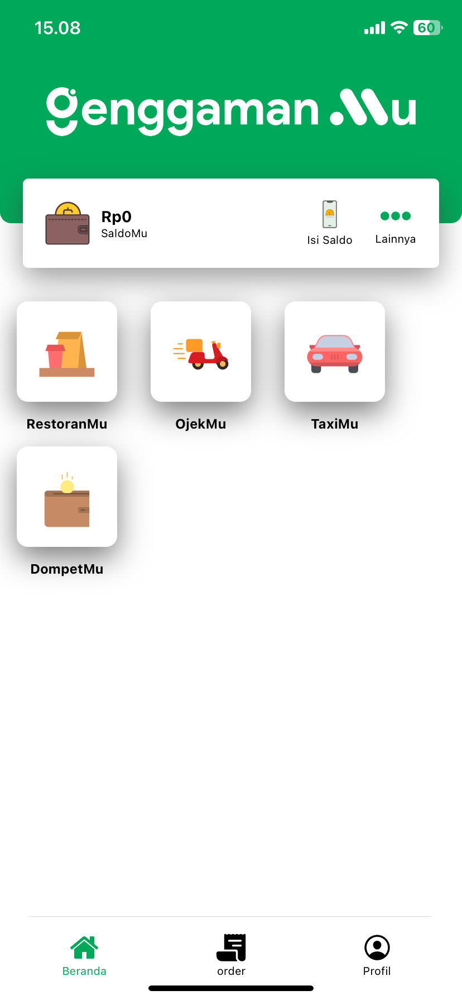
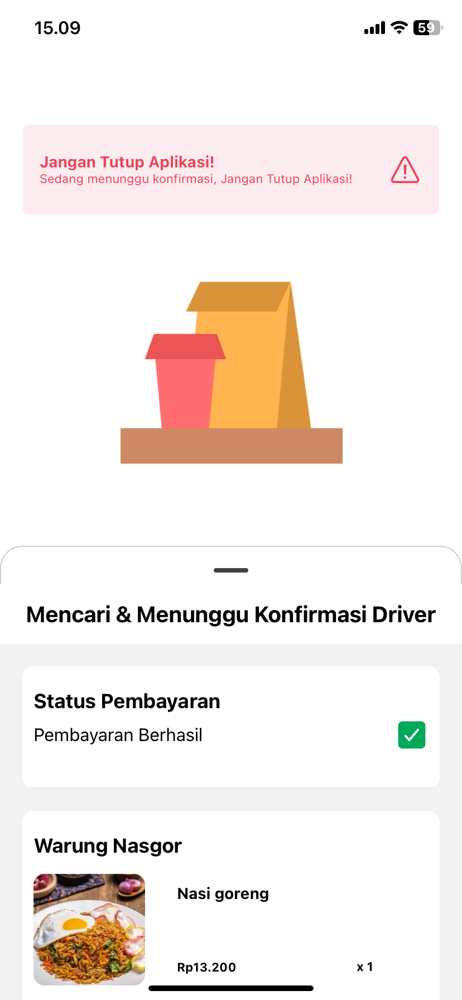

# Hi there! 👋 I'm Doni Indira Putra

## 🚀 About Me

I'm a **Software Developer** ❤️ passionate about creating innovative solutions and learning new technologies through hands-on experience.

- 🌍 Born in Jakarta, grew up in Long Iram sub-district, Kutai Barat district, East Kalimantan province, Indonesia 🇮🇩
- 💻 Started my programming journey with **C/C++** and **QT Designer** for desktop applications
- 🌐 Transitioned to web development with **CodeIgniter**, then discovered **Laravel**
- 📱 Explored **Flutter** before settling on **React Native** for mobile development
- 🔍 Always eager to explore new technologies and frameworks

My coding journey began differently than most - instead of starting with web basics, I dove into systems programming with C and C++ for university projects. This foundation gave me a solid understanding of programming fundamentals before I ventured into web and mobile development.

## 💼 Professional Experience

### Software Developer at [HK Teknologi](https://hktekno.com/)
**Current Position**

### Fullstack Developer
- Developed backend and mobile apps 
- **Tech Stack:** Laravel (Backend), React Native with Expo (Mobile)

### Web Developer Intern at [CV Beesoft Research & Technology (Britech)](https://britech.id/)
- Frontend development using **OctoberCMS**
- Worked on Samarinda City's Geographic Information System
- Gained valuable experience with CMS platforms

## 🛠️ Technical Skills

### Primary Technologies

### Additional Technologies

### Currently Learning

## 🎯 Core Competencies

- **Backend Development:** Laravel, PHP, API Design & Development
- **Mobile Development:** React Native, Expo, Cross-platform Applications
- **Frontend Development:** React.js, Next.js, Tailwind CSS
- **Database Management:** MySQL, Database Design & Optimization
- **System Integration:** Payment Gateways, Third-party APIs
- **Project Management:** Full-stack project delivery, Client Communication

## 📱 Featured Projects

### 🏢 Enterprise & Business Applications

#### SMEXPO Pertamina (2022-2023)

**Backend Developer** | [Live Site](https://smexpo.pertamina.com/)

A comprehensive exhibition management system for PT Pertamina's business expo events on 2022-2023.

**Key Features:**
- Event management dashboard
- Exhibitor registration and management
- Visitor tracking and analytics

**Tech Stack:** Laravel, Tailwind CSS, MySQL
**My Role:** Developed robust backend APIs, implemented authentication system, and created admin dashboard

---

### 🏃‍♀️ Event Management Systems

#### Mahakam Korpri Run 5K 2024

**Full Stack Developer**

A complete event registration platform for the annual Mahakam Korpri Run 5K race in East Kalimantan.

    
    
    
    
    

**Key Features:**
- Online registration system with form validation
- Secure payment gateway integration for racepack purchases
- Automated BIB number generation and assignment
- Photo gallery for participant BIB photos
- Interactive prize draw spinner for event prizes
- Real-time participant tracking and management

**Tech Stack:** Laravel, MySQL, Payment Gateway APIs, JavaScript
**My Role:** End-to-end development from registration system to prize mechanics

---

#### Hermina Run 2025

**Full Stack Developer**

An empowering run event platform with advanced registration and community features.

**Key Features:**
- Online registration system with form validation
- Secure payment gateway integration for racepack purchases
- Automated BIB number generation and assignment
- Photo gallery for participant BIB photos
- Interactive prize draw spinner for event prizes
- Real-time participant tracking and management

**Tech Stack:** Laravel, MySQL, Payment Gateway APIs, JavaScript
**My Role:** End-to-end development from registration system to prize mechanics

---

### 🏃‍♀️ E-commerce Management

#### Toko Bazar

**Developer Backend**

    
    
    
    

**Key Features:**
- Backend apis for mobile apps
- Dashbboard management

**Tech Stack:** Laravel, JavaScript
**My Role:** Developed robust backend APIs, implemented authentication system, and created admin dashboard

---

### 📱 Mobile Applications

#### GenggamanMu - Food Delivery App

**Full Stack Mobile Developer**

    
    
    
    
    

A comprehensive food delivery application serving local restaurants and customers.

**Key Features:**
- **Customer App:** Browse restaurants, place orders, real-time tracking, payment integration
- **Restaurant App:** Menu management, order processing
- **Delivery Tracking:** Real-time GPS tracking for deliveries
- **Payment System:** Multiple payment options including digital wallets
- **Push Notifications:** Order updates and promotional notifications

**Tech Stack:** 
- **Backend:** Laravel, MySQL, RESTful APIs, Redis, Neumatim, Valhalla ORM, Docker, Firebase
- **Mobile:** React Native with Expo
- **Real-time:** Firebase Realtime Database
- **Maps:** Google Maps API integration, Neumatim Geocode/Reverse Geocode, Valhalla ORM Machine Routing

**My Role:** Full-stack development including backend API design, mobile app development, and system integration

**Official Manual Guides :** https://docs.genggamanmu.com/

---

### 🌐 Web Development Projects

#### Samarinda Geographic Information System

**Frontend Developer Intern** | CV Beesoft Research & Technology

A comprehensive Geographic Information System for Samarinda City government.

**Key Features:**
- Web design
- Location-based data visualization

**Tech Stack:** OctoberCMS, JavaScript, HTML, CSS
**My Role:** Frontend development using OctoberCMS, created interactive map interfaces and data visualization components

---

## 🌱 What I'm Currently Exploring

I'm always keeping up with the constantly evolving tech landscape - its tools, libraries, frameworks, and the vibrant community discussions that make this field so dynamic and exciting. Currently diving deeper into:

- **Go (Golang)** for backend services
- **TensorFlow** for machine learning applications
- **Docker** for containerization
- **Apache Kafka** for distributed systems

## 📫 Let's Connect!

I'm always interested in collaborating on interesting projects or discussing new technologies. Feel free to reach out!

- 🌐 **Website:** [profile.maskablog.my.id](https://profile.maskablog.my.id/)
- 💼 **LinkedIn:** [linkedin](https://www.linkedin.com/in/doni-indira-putra-169512206/)

---

*"I'm the kind of person who loves to learn new things, especially through hands-on experience."*